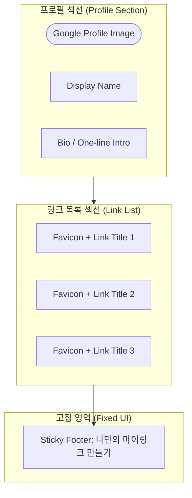

# [Wireframe] 마이링크 메인 화면 (방문자용)

본 문서는 방문자가 `mylink.com/displayName` 접속 시 보게 되는 메인 화면의 구조를 정의합니다.

## 1. UI 구조 (Mermaid 다이어그램)



## 2. 시각적 구조 (ASCII Art)

```text
+---------------------------------------+
|                                       |
|             (  Avatar  )              |  <-- 구글 프로필 이미지 (자동 연동)
|             Display Name              |  <-- 지메일 프리픽스 (초기값)
|        "안녕하세요! 반가워요 ✨"         |  <-- Bio
|                                       |
+---------------------------------------+
|                                       |
|  +---------------------------------+  |
|  | [f]  GitHub                   > |  |  <-- [f]는 구글 API 기반 파비콘
|  +---------------------------------+  |
|                                       |
|  +---------------------------------+  |
|  | [f]  Instagram                > |  |
|  +---------------------------------+  |
|                                       |
|  +---------------------------------+  |
|  | [f]  My Blog                  > |  |
|  +---------------------------------+  |
|                                       |
+---------------------------------------+
|                                       |
|      [ 나만의 마이링크 만들기 🚀 ]       |  <-- Sticky Footer (고정 푸터)
|                                       |
+---------------------------------------+
```

## 3. 스켈레톤 UI (로딩 상태)

데이터를 불러오는 중에는 아래와 같은 스켈레톤 UI가 노출됩니다.

```text
+---------------------------------------+
|                                       |
|             (  ######  )              |  <-- Circle Skeleton
|             ##########                |  <-- Text Skeleton
|        #######################        |
|                                       |
+---------------------------------------+
|                                       |
|  +---------------------------------+  |
|  | [ ]  #######################    |  |  <-- Card Skeleton
|  +---------------------------------+  |
|                                       |
|  +---------------------------------+  |
|  | [ ]  #######################    |  |
|  +---------------------------------+  |
|                                       |
+---------------------------------------+
```

## 4. UI/UX 세부 사양
- **프로필 이미지**: 별도의 업로드 없이 구글 계정의 `photoURL`을 사용하며, 원형 또는 부드러운 라운드 처리.
- **링크 카드**: shadcn/ui의 Card 컴포넌트를 활용. 마우스 호버 시 미세한 부풀어 오름(Scale) 효과.
- **고정 푸터**: 페이지 하단에 항상 고정(sticky)되어 있으며, 가입 페이지로 연결되는 강력한 Call-to-Action(CTA).
- **파비콘**: 사용자가 입력한 URL의 도메인을 기반으로 Google API를 통해 실시간 로드.
