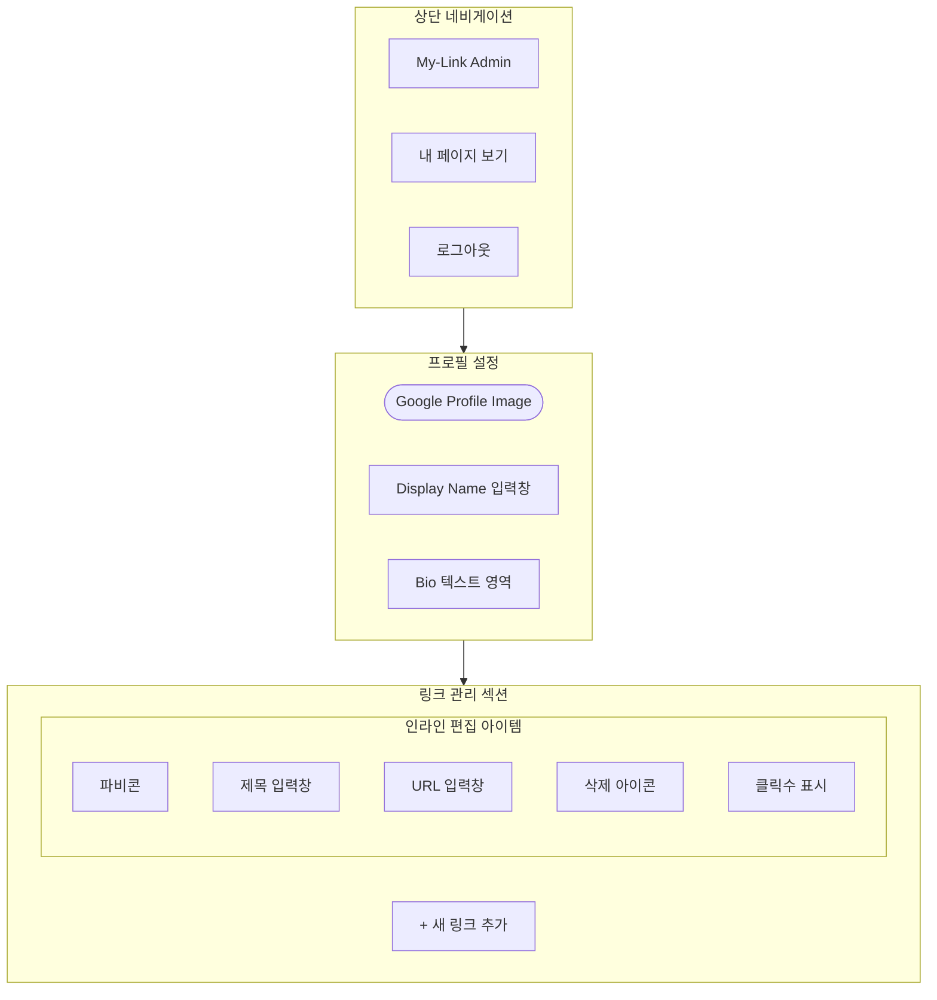

# [Wireframe] 마이링크 UI 구조 정의서

본 문서는 방문자용 메인 화면과 소유자용 관리 화면의 UI 구조를 정의합니다.

## 1. UI 구조 (Mermaid 다이어그램)


## 2. 시각적 구조 (ASCII Art)

```text
+---------------------------------------+
|                                       |
|             (  Avatar  )              |  <-- 구글 프로필 이미지 (자동 연동)
|             Display Name              |  <-- 지메일 프리픽스 (초기값)
|        "안녕하세요! 반가워요 ✨"         |  <-- Bio
|                                       |
+---------------------------------------+
|                                       |
|  +---------------------------------+  |
|  | [f]  GitHub                   > |  |  <-- [f]는 구글 API 기반 파비콘
|  +---------------------------------+  |
|                                       |
|  +---------------------------------+  |
|  | [f]  Instagram                > |  |
|  +---------------------------------+  |
|                                       |
|  +---------------------------------+  |
|  | [f]  My Blog                  > |  |
|  +---------------------------------+  |
|                                       |
+---------------------------------------+
|                                       |
|      [ 나만의 마이링크 만들기 🚀 ]       |  <-- Sticky Footer (고정 푸터)
|                                       |
+---------------------------------------+
```

## 3. 스켈레톤 UI (로딩 상태)

데이터를 불러오는 중에는 아래와 같은 스켈레톤 UI가 노출됩니다.

```text
+---------------------------------------+
|                                       |
|             (  ######  )              |  <-- Circle Skeleton
|             ##########                |  <-- Text Skeleton
|        #######################        |
|                                       |
+---------------------------------------+
|                                       |
|  +---------------------------------+  |
|  | [ ]  #######################    |  |  <-- Card Skeleton
|  +---------------------------------+  |
|                                       |
|  +---------------------------------+  |
|  | [ ]  #######################    |  |
|  +---------------------------------+  |
|                                       |
+---------------------------------------+
```

## 4. UI/UX 세부 사양
- **프로필 이미지**: 별도의 업로드 없이 구글 계정의 `photoURL`을 사용하며, 원형 또는 부드러운 라운드 처리.
- **링크 카드**: shadcn/ui의 Card 컴포넌트를 활용. 마우스 호버 시 미세한 부풀어 오름(Scale) 효과.
- **고정 푸터**: 페이지 하단에 항상 고정(sticky)되어 있으며, 가입 페이지로 연결되는 강력한 Call-to-Action(CTA).
- **파비콘**: 사용자가 입력한 URL의 도메인을 기반으로 Google API를 통해 실시간 로드.

---

## 5. 소유자용 관리 화면 (Admin UI)

소유자가 로그인을 통해 자신의 프로필과 링크를 편집하는 화면입니다.

### 5.1 관리 화면 구조 (Mermaid 다이어그램)



### 5.2 관리 화면 시각적 구조 (ASCII Art)

```text
+---------------------------------------+
|  MY-LINK [Admin]    [내 페이지] [로그아웃] |
+---------------------------------------+
|                                       |
|  (  Avatar  )  이름: [ HaeSeul      ] |  <-- displayName 수정
|                소개: [ 한 줄 소개... ] |  <-- bio 수정
|                                       |
+---------------------------------------+
|                                       |
|   [ + 새 링크 추가 ]                    |
|                                       |
|  +---------------------------------+  |
|  | [f] 제목: [ GitHub            ] |  |  <-- 인라인 제목 수정
|  |     URL : [ https://github... ] |  |  <-- 인라인 URL 수정
|  |     (클릭수: 12)        [삭제]  |  |
|  +---------------------------------+  |
|                                       |
|  +---------------------------------+  |
|  | [f] 제목: [ Instagram         ] |  |
|  |     URL : [ https://instagr... ] |  |
|  |     (클릭수: 5)         [삭제]  |  |
|  +---------------------------------+  |
|                                       |
+---------------------------------------+
|                                       |
|        [ 모든 변경사항 자동 저장 ]        |
+---------------------------------------+
```

### 5.3 주요 기능 사양 (Admin)
- **인라인 편집 (Inline Editing)**: 별도의 수정 페이지 이동 없이 관리 화면 리스트에서 즉시 텍스트를 클릭하여 수정할 수 있습니다.
- **자동 파비콘 반영**: URL 입력창에 주소를 입력하는 즉시 Google API를 통해 파비콘이 실시간으로 업데이트되어 노출됩니다.
- **실시간 데이터 동기화**: Firestore를 사용하여 별도의 '저장' 버튼 없이도 데이터가 변경될 때마다 자동으로 동기화됩니다.
- **클릭 통계**: 각 링크별로 누적 클릭 수를 시각적으로 확인할 수 있습니다. (Phase 2)
